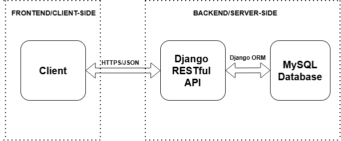
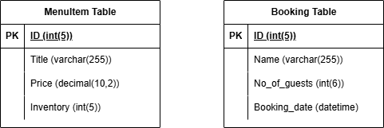
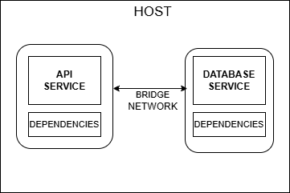

**Restaurant Management API (AsgardCuisines)**  
A secure, containerized RESTful API for modern restaurant management, built with Django, MySQL, and Docker. This is version 1 of a continuously evolving cloud-native system. 

**Project Scope**  
This project focuses on secure containerization and local orchestration using Docker Compose. Cloud-native services (EKS, IAM, Secrets Manager) are explored in later iterations.

**Installation & Setup**  
Follow these steps to get the AsgardCuisines API running using Docker.

 1. Prerequisites
  - Docker Desktop (or Docker Engine on Linux)
  - Git

 2. Clone the Repository

```bash  
git clone https://github.com/ChukaOkeke/restaurant-api-docker.git
cd restaurant-api-docker  
```

 3. Environment Configuration  
 The project uses a .env file to manage sensitive database credentials  
  - Copy the template file:
```bash  
cp .env.example .env
```

  - Open .env and verify the settings:  
     DB_NAME=restaurant_db  
     DB_USER=asgard_admin  
     DB_PASSWORD=your_secure_password  
     MYSQL_ROOT_PASSWORD=your_super_secret_root_password  

 4. Launch the infrastructure  
 Pull the official MySQL and custom API images and start the system in the background. 

 ```bash
 docker-compose up -d
 ```

  Note: On the first run, the database initialization on WSL2 may take 3-5 minutes. The API service is configured to wait until the database is officially healthy before starting.  
  If the API service does not start alongside the database service, run:
 
 ```bash
 docker compose restart web
 ```

 5. Apply Database Migrations  
 Once the containers are running and healthy, create the necessary database tables:

 ```bash
 docker compose exec web python manage.py migrate
 ```

 6. Access the Application  
 The API will be available at http://127.0.0.1:8000/ or http://localhost:8000/.

**API Endpoints**  
The API supports the following endpoints for managing menu items and table bookings.

### API Endpoints

| **Method** | **Endpoint** | **Description** | **Authentication** |
| :--- | :--- | :--- | :--- |
| `GET` | `/api/menu-items/` | List all menu items | Public |
| `POST` | `/api/menu-items/` | Create a new menu item | Admin Only |
| `GET` | `/api/menu-items/<id>/` | Get details of a specific item | Public |
| `PUT/PATCH` | `/api/menu-items/<id>/` | Update a menu item | Admin Only |
| `DELETE` | `/api/menu-items/<id>/` | Remove an item | Admin Only |
| `GET` | `/api/booking/tables/` | View all active bookings | Authenticated |
| `POST` | `/api/booking/tables/` | Create a new table reservation | Authenticated |
| `DELETE` | `/api/booking/tables/<id>/` | Cancel a reservation | Owner/Staff |
| `GET` | `/auth/users/` | List all registered users | Admin Only |
| `POST` | `/auth/users/` | Register a new user | Public |
| `POST` | `/auth/token/login` | Generate an auth token for session access | Public |
| `POST` | `/auth/users/logout` | Logout the user | Public |

**1. Problem & Constraints**  
 **Problem Statement**  
 The goal was to design a secure, scalable backend API for restaurant bookings and menu management that could evolve from Docker Compose to Kubernetes and later to cloud-native services.  

 **Constraints**  
 - Cost-efficient local development
 - Secure handling of secrets
 - Container portability
 - Clear seperation of services  


**2. Architecture Overview**  
 **Diagram**  
 - **System Architecture**   

   
 
 - **Database Schema (ERD)**

 

 Key Entities: MenuItem, Booking.

 - **Containerization**

 

 **Component responsibilities**  
AsgardCuisines utilizes a decoupled architecture to ensure independent scalability of the data and application layers
 - Frontend: Interacts with the backend via RESTful endpoints.
 - Application Layer: Managed by Django, handling business logic and request routing.
 - Database layer: A MySQL instance ensures ACID-compliant transactions for all menu and booking data.
 - Communication: The Client interacts with the Django API via stateless HTTPS requests, exchanging data in JSON format to ensure compatibility with modern frontend frameworks. The API interacts with the Database using Django ORM. Also, a bridge network in the host enables communication between the API and database services in the multi-containers.

 **Trust boundaries**  
 **Trust Boundary 1: Client -> API (Public Network)**  
 - All incoming HTTP requests originate from untrusted clients.
 - Requests are validated at the API layer using schema validation and authentication tokens.
 - Only authenticated requests are allowed to access protected endpoints.

**Trust Boundary 2: API Service -> Database**
- The database is not exposed to the public network.
- The API is the only trusted component allowed to communicate with the database.
- Database credentials are injected via environment variables and not hardcoded.

**Trust Boundary 3: Docker Network (Inter-service Communication)**
- Services communicate over an isolated Docker bridge network.
- No service is directly exposed unless explicitly mapped via ports.
- Internal service names are used instead of IP addresses.

**Trust Boundary 4: Secrets Handling**  
- Sensitive configuration values (DB credentials, secret keys) are managed via environment variables.
- Secrets are never committed to secure control.
- Access to secrets is limited to the application container.


**3. Key Design Decisions & Trade-offs**
- Chose Django for its robustness and security as a python-based web framework
- Chose MySQL for its ACID compliance, ensuring that order transactions are never lost or duplicated.
- Chose Docker Compose over Kubernetes for local dev to reduce operational overhead.
- Used environment variables instead of hardcoded secrets to prepare for cloud secret managers.
- Deferred Redis caching to avoid premature optimization.  

   
**4. Implementation**  
 This phase focused on building a modular, scalable codebase.
  - Logic Highlights: Used Django Rest Framework (DRF) to create APIs for Menu and Booking. Used DRF's djoser library to easily implement token authentication for user registration, login, and logout.

**5. Testing & Quality Assurance**  
 Quality was ensured through a comprehensive testing suite:
  - Unit Tests: Validating individual model methods, views, and serializers.
  - Integration Tests: End-to-end testing of API endpoints using the Insomnia REST client. 
  - Execution:

 ```bash
 pip install -r requirements-dev.txt && python3 manage.py test
 ```

**6. Security**  
 Security was integrated into the development pipeline at several layers rather than added as an afterthought to protect against common web vulnerabilities:
 - Used **JWT (JSON Web Tokens)** for user authentication and authorization.
 - Used Bandit for **Static Application Security Testing (SAST)**.    
 Run Audit:

 ```bash
 pip install -r requirements-dev.txt && bandit -c pyproject.toml -r .
 ```
Bandit results:  


 - Focused on defenses against SQL injection, Cross-Site Scripting (XSS), and Cross-Site Request Forgery (CSRF).

 - Used environment variables to handle secrets (like database credentials) instead of hardcoding.

 - Used Trivy for container scanning.  

 Run Audit:

 ```bash
 pip install -r requirements-dev.txt && trivy image chukaokeke/restaurant-api:v2
 ```

Run audit for available patches:

 ```bash
 trivy image --ignore-unfixed chukaokeke/restaurant-api:v2
 ```

Trivy results:  


**7. Containerization**  
Docker/Docker Compose was used for the multi-environment containerization (Django API in one container, MySQL database in another) and local  orchestration.

**Tech Stack**
 - Backend: **Python / Django**
 - Database: **MySQL** 
 - Containerization: **Docker / Docker Compose**
 - Security: **Bandit / JWT / Trivy**
 - API Tools: **Insomnia**

**Deep Dive**  
This repository focuses on implementation, containerization, and local orchestration of the Restaurant Management API using Docker and Docker Compose.  
A detailed breakdown of the architectural decisions, design trade-offs, security boundaries, and lessons learned during the containerization process is documented here on [Designing a Secure Dockerized Restaurant Management API](https://medium.com/@chukaokeke/designing-a-secure-dockerized-restaurant-management-api-e3cadebf9635)

